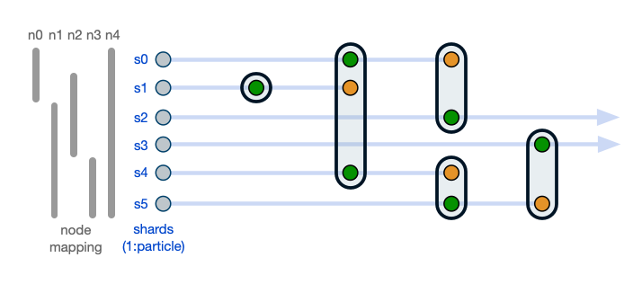

# Consensus Roadmap for Radix Public Network

Last updated: Friday, January 22, 2021

Cerberus is the consensus protocol designed for the Radix Public Network. The full Cerberus protocol will enable a parallelized network capable of practically unlimited, linearly scalable transaction throughput. Our first Radix Public Network release, Olympia (also called "RPN-1"), will not implement the full Cerberus protocol, but instead a simplified, unsharded version that will allow us to deploy a network with maximum confidence.

(An overview of development progress toward release of Olympia can be found [here](https://github.com/radixdlt/docs/blob/master/releases/drops.md).)

Fully sharded Cerberus will be developed in multiple stages toward a Radix public network upgrade beyond Olympia to be announced. This roadmap briefly summarizes the primary consensus design features of these three anticipated consensus development stages.

Note that these are *internal* development stages – not necessarily releases intended to be released immediately to the Radix public network. In particular, State-sharded Cerberus is likely to be an internal milestone only and not released for the Radix public network. It is a necessary development stage, but is unlikely to offer any practical throughput benefit over unsharded Cerberus. Fully Sharded Cerberus is our target for a later upgrade to the Radix public network.

*A roadmap for application layer functionality using the Radix Engine is independent of the consensus roadmap and is not considered here.*

*This roadmap is a current snapshot of thinking and is very likely to change in the course of development.*

## Unsharded Cerberus ([in progress](https://github.com/radixdlt/docs/blob/master/releases/drops.md))

| Goal | Deploy BFT 3-phase commit foundation for Cerberus |
| ---- | ----------- |
| Data Structure | Functionally unsharded, with Atoms grouped into global blocks and structured for later sharding |
| Validator Node Set Size | Fixed size, minimum 100 |
| Node Mapping | All nodes mapped to all shards |
| Sybil Protection | DPoS |

## State-sharded Cerberus

| Goal | Deploy sharding of Atoms within Cerberus, but continuing to require all nodes to validate all shards |
| ---- | ----------- |
| Data Structure | *Fully sharded to enable dependency-driven parallelization* |
| Validator Node Set Size | Fixed size, minimum 100 |
| Node Mapping | All nodes mapped to all shards |
| Sybil Protection | DPoS |

## Fully Sharded Cerberus

| Goal | Deploy full Cerberus with consensus parallelized across many physical nodes, achieve linear scalability |
| ---- | ----------- |
| Data Structure | Fully sharded |
| Validator Node Set Size | *Unlimited* |
| Node Mapping | *Nodes mapped dynamically* to shards for hardware parallelization while maintaining per-shard overlap for security |
| Sybil Protection | DPoS or potential alternative if available |
