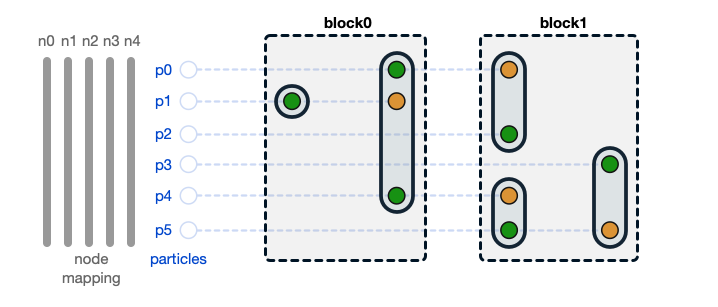

# Consensus Roadmap for Radix Public Network

Last updated: Friday, March 3, 2020

Cerberus is the consensus protocol designed for the Radix Public Network. The full Cerberus protocol will enable a parallelized network capable of very high transaction throughput. Our first Radix Public Network release, RPN-1, will not implement the full Cerberus protocol, but instead a simplified, unsharded version that will allow us to deploy a network with maximum confidence.

(An overview of the development plan for RPN-1 can be found [here](https://github.com/radixdlt/docs/blob/master/releases/drops.md).)

Our current plan is to follow RPN-1 with network releases RPN-2 and RPN-3 that will progressively layer in the full functionality and throughput capability of Cerberus. This roadmap briefly summarizes the primary consensus design features of these three anticipated network releases.

*A roadmap for application layer functionality using the Radix Engine is independent of the consensus roadmap and is not considered here.*

*This roadmap is a current snapshot of thinking and is very likely to change in the course of development.*

## RPN-1 (in progress)

| Goal | Deploy BFT 3-phase commit foundation for Cerberus |
| ---- | ----------- |
| Data Structure | Functiontionally unsharded, with Atoms (structured for later sharding) grouped into global blocks |
| Validator Node Set Size | Fixed, minimum 100 |
| Node Mapping | All nodes mapped to all shards |
| Sybil Protection | DPoS |

## RPN-2

| Goal | Deploy sharding of Atoms within Cerberus, increase throughput |
| ---- | ----------- |
| Data Structure | *Fully sharded to introduce parallelization of consensus* |
| Validator Node Set Size | Fixed, minimum 100 |
| Node Mapping | All nodes mapped to all shards |
| Sybil Protection | DPoS |

## RPN-3

| Goal | Deploy full Cerberus, achieve linear scalability |
| ---- | ----------- |
| Data Structure | Fully sharded, as in RPN-2 |
| Validator Node Set Size | *Unlimited* |
| Node Mapping | *Nodes mapped dynamically* to shards for hardware parallelization while maintaining per-shard overlap for security |
| Sybil Protection | DPoS or potential alternative if available |
